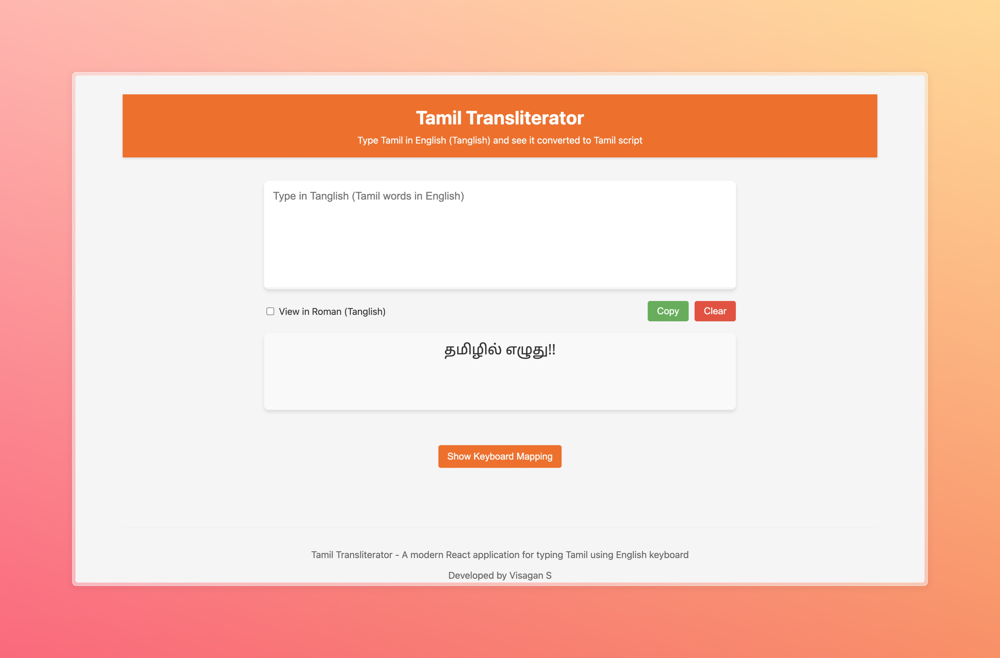

# Tamil Transliterator

A modern React application for typing Tamil using an English keyboard. This application enables users to type in Tanglish (Tamil words written in English letters) and see it automatically convert to Tamil Unicode characters in real-time.



## Features

- **Real-time Transliteration**: Type in English and see Tamil script instantly
- **Toggle View**: Switch between Tamil and Roman (Tanglish) script
- **Keyboard Mapping Guide**: Comprehensive reference for Tamil letter mappings
- **Copy and Clear Functions**: Easily copy transliterated text or clear the input
- **Responsive Design**: Works on desktop and mobile devices
- **Accessibility**: Keyboard shortcuts and screen reader support

## Demo

Try the live demo: [Tamil Transliterator Demo](https://your-demo-url.com)

## Installation and Setup

### Prerequisites

- Node.js (v14.0.0 or higher)
- npm (v6.0.0 or higher)

### Installation

1. Clone the repository:
   ```bash
   git clone https://github.com/VisaganSP/tamil-transliterator.git
   cd tamil-transliterator
   ```

2. Install dependencies:
   ```bash
   npm install
   ```

3. Start the development server:
   ```bash
   npm start
   ```

4. Open your browser and visit:
   ```
   http://localhost:3000
   ```

## Usage Guide

### Basic Usage

1. Type Tamil words using English characters in the input field
2. See the Tamil script appear in the output area below
3. Use the "View in Roman" toggle to switch between Tamil and Roman scripts
4. Click "Copy" to copy the transliterated text to clipboard
5. Click "Clear" to reset both input and output fields

### Keyboard Mapping

The transliteration follows standard Tamil phonetic mapping:

#### Basic Vowels
- a → அ
- A/aa → ஆ
- i → இ
- I/ii → ஈ
- u → உ
- U/uu → ஊ
- e → எ
- E/ee → ஏ
- ai → ஐ
- o → ஒ
- O/oo → ஓ
- au → ஔ
- q → ஃ

#### Consonants
- ka → க
- nga → ங
- sa/ca → ச
- nja → ஞ
- ta/da → ட
- Na → ண
- tha/dha → த
- na/wa → ந
- pa/ba → ப
- ma → ம
- ya → ய
- ra → ர
- la → ல
- va → வ
- Ra → ற
- La → ள
- za/zha → ழ
- na → ன

#### Sanskrit Characters
- Sa → ஸ
- sha → ஷ
- ja → ஜ
- ha → ஹ
- ksh → க்ஷ
- sri → ஸ்ரீ

Add vowel sounds after consonants to form combined characters. For example:
- ki → கி
- kee → கே
- ku → கு

### Examples

| English Input | Tamil Output |
|---------------|-------------|
| vanakkam | வணக்கம் |
| thamizh | தமிழ் |
| inRaikkum | இன்றைக்கும் |
| eppadi irukkirkal | எப்படி இருக்கிறகள் |

## Development

### Project Structure

```
tamil-transliterator/
├── public/
│   ├── index.html
│   ├── favicon.ico
│   └── manifest.json
├── src/
│   ├── components/
│   │   ├── TamilTransliterator.js
│   │   ├── KeyboardHelp.js
│   │   └── Footer.js
│   ├── utils/
│   │   └── transliterationUtils.js
│   ├── styles/
│   │   ├── App.css
│   │   └── TamilTransliterator.css
│   ├── App.js
│   ├── index.js
│   └── App.test.js
├── package.json
└── README.md
```

### Key Files

- `src/utils/transliterationUtils.jsx`: Contains the transliteration logic
- `src/components/TamilTransliterator.jsx`: Main component for the transliteration interface
- `src/components/KeyboardHelp.jsx`: Component for displaying keyboard mapping help

### Testing

Run the test suite:

```bash
npm test
```

The project includes tests for:
- Basic rendering
- Transliteration functionality
- Toggle view functionality

### Building for Production

Create a production build:

```bash
npm run build
```

The build files will be in the `build/` directory.

## Extending the Transliterator

### Adding New Character Mappings

1. Open `src/utils/transliterationUtils.js`
2. Add new pattern-replacement pairs to the `replacements` array:
   ```javascript
   { pattern: /newPattern/g, replacement: "\uUNICODE_HERE" }
   ```
3. Update the `KeyboardHelp.js` component to include your new mappings

### Implementing Reverse Transliteration

The foundation for reverse transliteration (Tamil to English) is included in the codebase. To fully implement it:

1. Expand the `transliterateFromTamil` function in `transliterationUtils.js`
2. Add UI controls to select transliteration direction

## Contributing

Contributions are welcome! Please feel free to submit a Pull Request.

1. Fork the repository
2. Create your feature branch (`git checkout -b feature/amazing-feature`)
3. Commit your changes (`git commit -m 'Add some amazing feature'`)
4. Push to the branch (`git push origin feature/amazing-feature`)
5. Open a Pull Request

## Acknowledgments

- Tamil Unicode reference from [Unicode.org](https://unicode.org/charts/PDF/U0B80.pdf)
- Special thanks to the Tamil computing community

## Contact

Visagan S - [visagansvvg@gmail.com](mailto:visagansvvg@gmail.com)

Project Link: [https://github.com/VisaganSP/tamil-transliterator](https://github.com/VisaganSP/tamil-transliterator)